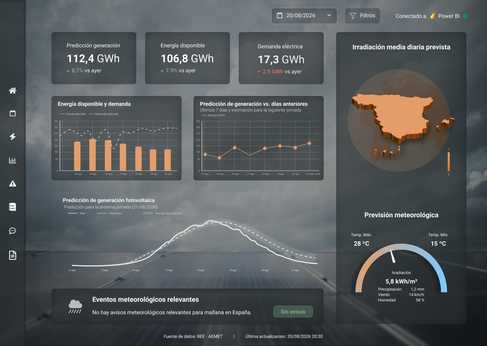

# `PROYECTO:` Predicción de generación renovable

> **Nota de revisión:** este es el documento que más se ha desviado del planteamiento inicial, principalmente por una limitación técnica no anticipada (Power BI no permite, con cuenta gratuita en algunos tenants, la función "Publicar en la Web" necesaria para embeber informes en un iframe externo). Esto obligó a replantear la arquitectura del frontal durante el desarrollo. Se mantiene la estructura del documento, señalando los cambios en cada sección.

# Resumen de la solución y del usuario

El proyecto predice la **generación solar fotovoltaica nacional de la siguiente jornada** utilizando información disponible antes del momento de la predicción, integrando la generación histórica de REE con variables meteorológicas de AEMET (retardadas 1 día) y variables temporales.

El usuario principal se mantiene sin cambios: un **analista o profesional de planificación y seguimiento del sistema eléctrico**.

El producto final es un **dashboard operativo en Angular**, con gráficos nativos (Chart.js) alimentados directamente por los datos generados en el pipeline de Python, más un **asistente conversacional (RAG)** que explica el modelo y sus resultados.

**Cambio respecto al planteamiento inicial:** el resultado ya no se acompaña de un **intervalo de predicción** (el modelo de Regresión Lineal usado no lo proporciona de forma nativa, y no se llegó a calcular una estimación empírica alternativa). Se mantiene la comparación con jornadas anteriores y la explicación resumida de los factores del modelo, esta última cubierta por el asistente conversacional.

# Imagen mockup del frontal



[Prototipo figma](https://www.figma.com/proto/mp7NUSAb3A5oYtRHj2JAPH/TFM---prediccion-generacion-renovable?node-id=1-3&p=f&t=5pS0oxNJUaRqda0a-0&scaling=min-zoom&content-scaling=fixed&page-id=0%3A1&device-frame=0)

El mockup y el prototipo de Figma originales representan una visión de producto más amplia que la finalmente implementada. Se conservan como referencia de diseño visual (menú lateral, imagen de fondo, disposición de tarjetas), pero varios de los elementos que mostraban (mapa de irradiación, energía disponible, demanda eléctrica, previsión meteorológica horaria) no forman parte del dashboard entregado, por las razones que se detallan a continuación.

# Justificación del diseño

### Utilidad y valor de la solución

Se mantienen los principios de diseño originales (jerarquía visual, simplicidad, legibilidad, contextualización, control, feedback, accesibilidad, transparencia de los datos), implementados en la práctica así:

- **Jerarquía visual:** KPIs en la zona superior de cada página, gráficos debajo.
- **Transparencia de los datos:** pie de página con "Fuente de datos: REE · AEMET" y la fecha del último dato disponible, presente en las tres páginas del dashboard.
- **Control:** filtro de rango de fechas, que actualiza de forma sincronizada KPIs, gráficos y meteorología de referencia a la misma fecha objetivo.

**Cambio respecto al planteamiento inicial — la interfaz prioriza cuatro elementos, no cinco:**

1. **Predicción principal:** generación fotovoltaica estimada para la siguiente jornada, en GWh.
2. **Comparación histórica:** evolución de la generación real frente a la predicha, y comparación con la jornada anterior.
3. **Fiabilidad del modelo:** en vez de "contexto energético" (energía disponible/demanda), se muestra un indicador de cuánto mejora el modelo al baseline histórico y la estabilidad de esa mejora en el backtesting — información que sí está respaldada por datos reales del proyecto.
4. **Contexto meteorológico:** temperatura máxima/mínima/media, precipitación, viento, humedad y horas de sol — pero etiquentado explícitamente como **"meteorología de referencia (día anterior)"**, no como previsión del día que se predice, para no dar una imagen inexacta de lo que el modelo realmente usa.

El elemento de **"contexto energético" (energía disponible y demanda eléctrica)** se elimina por completo: el proyecto no descarga ni tiene acceso a datos de demanda eléctrica, y "energía disponible" no llegó a definirse con una fuente de datos real en ningún momento del desarrollo. Mantenerlo en el dashboard habría implicado mostrar cifras sin respaldo.

Las tres preguntas que debía responder la pantalla principal se mantienen, con un matiz en la tercera:

> ¿Cuánta generación fotovoltaica se espera mañana? — Respondida por el KPI de predicción.
> ¿Cómo se compara con los días anteriores? — Respondida por el gráfico real vs. predicha y el KPI de variación.
> ¿En qué condiciones meteorológicas se ha basado la predicción? — Respondida por la meteorología de referencia del día anterior (no "en qué condiciones se producirá", que implicaría un forecast real no disponible).

### Flujo de usuario

Se mantiene el flujo general (acceso, selección de fecha, visualización de resultados, comparación, interpretación), con dos cambios:

**Cambio respecto al planteamiento inicial:** el paso de "procesamiento" (el sistema genera la predicción en el momento de la consulta) no ocurre en tiempo real desde el frontal — las predicciones se generan en el pipeline de Python (notebooks `01`-`05`) y se exportan como CSV estáticos que el dashboard consume. No hay una llamada al modelo en vivo desde Angular.

El paso de **"avisos"** (mensajes ante incidencias o eventos meteorológicos relevantes) no se implementó como sistema de notificaciones — se sustituye por el panel descriptivo de días de generación anormalmente baja, de naturaleza analítica/histórica, no de alerta operativa en tiempo real.

### Experiencia de usuario

Los principios de diseño se mantienen sin cambios conceptuales. Se implementaron con FontAwesome para la iconografía del menú lateral y un esquema de color oscuro con acentos naranjas, coherente con el mockup original.

# Presentación de resultados y explicabilidad

**Cambio respecto al planteamiento inicial — los KPI de la pantalla principal pasan de tres a cuatro, y cambian de contenido:**

- **Predicción de generación fotovoltaica:** se mantiene, con variación respecto a la generación real del día anterior.
- **Generación día anterior:** sustituye a "Energía disponible" — muestra el último dato real observado, con su propia variación respecto al día previo.
- **Fiabilidad del modelo:** sustituye a "Demanda eléctrica" — porcentaje de ventanas de backtesting en las que el modelo supera al baseline.
- **Variación vs. media del mes:** KPI añadido, no previsto en el planteamiento inicial — sitúa la generación del día en su contexto estacional (por encima o por debajo de lo habitual para esa época del año).

Las visualizaciones finalmente implementadas:

- **Generación fotovoltaica: real vs. predicha** — gráfico de líneas, filtrable por rango de fechas.
- **Comparación de modelos (MAE)** — gráfico de barras con Regresión Lineal, Random Forest, Gradient Boosting y baseline.
- **Estabilidad del modelo (backtesting)** — gráfico de líneas con las 18 ventanas evaluadas y línea de referencia en cero.
- **Error del modelo por mes (MAE)** — gráfico de barras.
- **Meteorología de referencia (día anterior)** — valores puntuales (temperatura, precipitación, sol, humedad) y gauges semicirculares para temperatura máxima y mínima.
- **Días de generación anormalmente baja** — tabla de detalle, KPIs de conteo/porcentaje, y un scatter de horas de sol vs. generación con los días de baja generación destacados y tooltip con el detalle meteorológico de cada punto.

**Cambio respecto al planteamiento inicial — elementos no implementados:**

- **Energía disponible y demanda:** no implementado (ver justificación arriba).
- **Mapa de irradiación media diaria:** no implementado — el proyecto no conserva el detalle geográfico de la meteorología (se agrega a nivel nacional), y el propio documento ya contemplaba este elemento como "progresivo según disponibilidad de datos".
- **Previsión meteorológica (para el día que se predice):** no implementada como tal — se sustituye por la meteorología de referencia del día anterior, explícitamente etiquetada como tal.
- **Intervalo de predicción:** no implementado (ver "Resumen de la solución").

Las métricas técnicas del modelo, la importancia de las variables y el análisis detallado de errores se mantienen fuera de la pantalla principal, tal como se planteaba, pero en vez de una "vista de análisis avanzado" dentro del propio dashboard, se implementaron como:

- Una **página de "Detalle técnico"** separada dentro del mismo dashboard Angular (backtesting, error por mes).
- Un **informe complementario en Power BI**, enlazado desde la documentación del proyecto (no embebido).
- Una **"Ficha del modelo"**, página de documentación dentro de Angular con el resumen de metodología, variables, métricas y limitaciones conocidas.

### IA generativa como capa de explicación

Implementado, con cambios de arquitectura respecto al planteamiento inicial:

**Cambio respecto al planteamiento inicial — arquitectura del chatbot:**

```text
Planteado:   Datos REE + AEMET → modelo predictivo → resultados → dashboard Angular/Power BI → chatbot de explicación

Implementado: Documentación del proyecto (PDFs: ficha del modelo, planteamiento, diseño)
                 → backend RAG en Python (FastAPI + LangChain + Gemini + ChromaDB)
                 → endpoint HTTP
                 → componente chatbot en Angular (ventana emergente, accesible desde el menú lateral)
```

El chatbot no consulta los resultados del modelo en tiempo real ni el propio dashboard — responde exclusivamente a partir de una base documental (los mismos documentos de planteamiento y la ficha del modelo, convertidos a PDF), mediante un agente RAG con recuperación de contexto (`retriever`) y memoria de conversación. Esto cumple igualmente el principio de mantener separadas las funciones de predicción y explicación, aunque por una vía distinta a la prevista: en vez de que el chatbot "vea" los resultados mostrados en el dashboard, explica el funcionamiento general del modelo y sus limitaciones a partir de su documentación.

Las preguntas de ejemplo que dependían de la demanda o del intervalo de predicción ("¿Qué diferencia existe entre la generación prevista y la demanda?", "¿Qué indica el intervalo de predicción?") no tienen respuesta disponible en la implementación actual, al no existir esos datos en el proyecto — el asistente está instruido para indicarlo explícitamente en vez de inventar una respuesta.

**Interfaz del chatbot:** se implementó como ventana emergente (popup) que no ocupa toda la pantalla, activada desde un icono del menú lateral, visible en cualquier página del dashboard — en vez de un botón flotante independiente sin relación con la navegación principal.

# Alcance del MVP

La parte funcional entregada coincide en gran medida con lo planteado:

- Obtención y preparación de datos de REE y AEMET — implementado (notebooks `01`, `02`).
- Construcción de la capa Gold — implementado (notebook `03`).
- Desarrollo y validación del modelo predictivo — implementado (notebooks `04`, `05`), con Regresión Lineal como modelo final.
- Generación de la predicción diaria — implementado, exportada como CSV consumido por el dashboard.
- Integración de los resultados en un dashboard — implementado en Angular, con Power BI como informe técnico complementario (no embebido).

**Cambio respecto al planteamiento inicial — KPIs del MVP:**

- KPI de generación fotovoltaica prevista — mantenido.
- KPI de energía disponible — **sustituido** por KPI de generación del día anterior.
- KPI de demanda eléctrica — **sustituido** por KPI de fiabilidad del modelo.
- _(Añadido, no previsto)_ KPI de variación vs. media del mes.

Comparación de la predicción con jornadas anteriores, comparación entre predicción y generación real, y visualización de las condiciones meteorológicas — implementados, con la salvedad ya indicada de que la meteorología es de referencia (día anterior), no previsión.

**Cambio respecto al planteamiento inicial — stack tecnológico del frontal:** Power BI se utiliza para el análisis técnico interno, tal como se planteaba, pero **no se integra en el frontal de Angular mediante iframe**, al no estar disponible la función de publicación web necesaria en la cuenta utilizada. Angular consume directamente los CSV generados por el pipeline de Python y los representa con Chart.js, replicando en componentes nativos los KPIs y gráficos diseñados originalmente en Power BI.

El diseño de Figma sigue representando una propuesta más amplia que el núcleo funcional del MVP, y las funcionalidades no implementadas permanecen como ampliaciones futuras:

- Análisis de eventos meteorológicos extremos.
- Análisis de resiliencia del sistema eléctrico.
- Estimación de necesidades de potencia y energía de respaldo.
- Análisis más detallado de déficit y cobertura de la demanda.
- Conservación y explotación de datos horarios de REE.
- Ampliación de las capacidades del chatbot (por ejemplo, que pueda consultar también los resultados en vivo del dashboard, no solo la documentación estática del proyecto).
- Mapa de irradiación geográfica.
- Cálculo de intervalos de predicción.
- Forecast meteorológico real con fecha de emisión, que eliminaría la limitación de usar meteorología del día anterior.

La predicción diaria de generación fotovoltaica nacional constituye el núcleo entregado del MVP, con un dashboard funcional en Angular y un asistente conversacional operativo, ambos construidos íntegramente sobre datos y resultados reales del proyecto.
